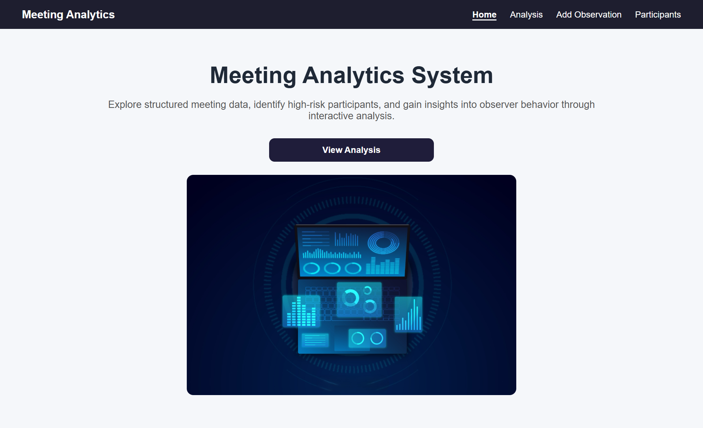
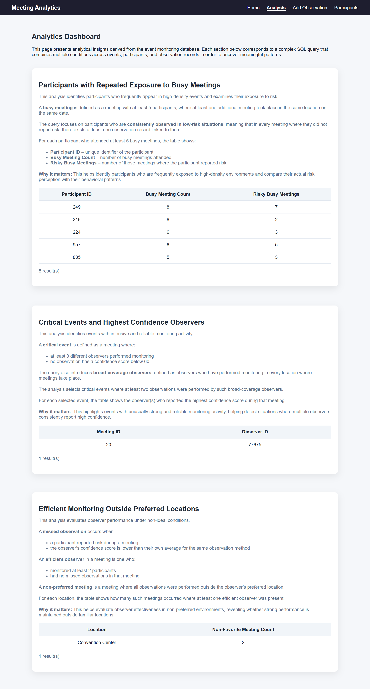
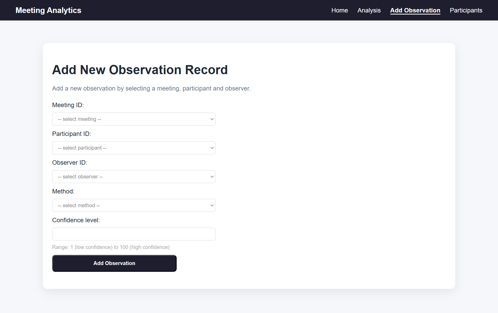
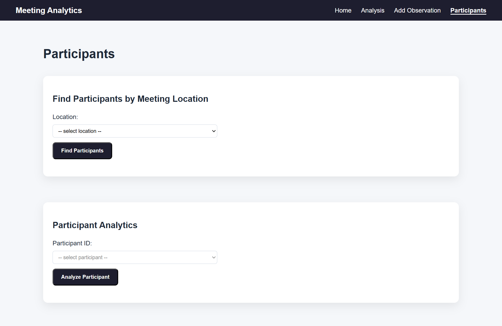

# Meeting Analytics System

Web-based system for analyzing meeting data using SQL-driven queries and a relational database backend.

---

## Overview

This project focuses on exploring structured meeting data and extracting meaningful insights using SQL.

The system allows users to:

- analyze participant activity across meetings
- explore relationships between participants, meetings and observations
- query and filter data based on user input

The main goal is to demonstrate the ability to work with relational data, design SQL queries and translate raw data into interpretable results.

---

## Key Features

- **Analytics Dashboard**
Analyze meeting data using complex SQL queries and aggregated metrics.

- Compute statistics for individual participants
- Work with grouped data and conditional aggregations
- Handle edge cases such as missing data (N/A) and zero values

- **Add Observation**
  Insert new observation records into the system:

  - validate user input using dropdown selections
  - prevent duplicate entries
  - ensure referenced entities exist

-  **Participant Analysis**
  - Analyze individual participant activity

-  **Location-Based Filtering**
  - Find participants by meeting location

---

## Technical Focus

This project demonstrates:

- writing **complex SQL queries**  
  - JOINs  
  - GROUP BY  
  - HAVING  
  - subqueries  
  - EXISTS / NOT EXISTS  
  - aggregation functions  

- designing and working with a **relational database schema**

- integrating SQL into a **Django backend**

- handling **data validation and business logic**

- building a structured and consistent **web interface**


---

## Database

The database schema was **reconstructed and implemented independently**, including:

- designing tables and relationships  
- defining keys and connections between entities  
- loading data from CSV files

---

## Data Model

The database schema is centered around meeting activity and monitoring relationships.

- **Meetings** captures when and where each meeting took place.
- **MeetingParticipants** represents participant attendance and stores a meeting-specific risk score.
- **Observers** stores monitoring agents and their preferred operating location.
- **Observations** records monitoring events by connecting a participant, an observer and a meeting, along with the observation method and confidence score.

The system supports:

- tracking participant activity across meetings  
- linking observations to specific participants and meetings  
- computing statistics based on risk and observation data  

---

## Tech Stack

- Python
- Django
- SQL (T-SQL / SQL Server)
- HTML, CSS

---

## Project Structure
```
meeting-analytics-system/
│
├── Meetings_App/
│ ├── views.py
│ ├── queries.py
│ ├── models.py
│ ├── urls.py
│ └── ...
│
├── config/
│ ├── settings.py
│ ├── urls.py
│ └── ...
│
├── templates/
├── static/
├── data/
│
├── manage.py
├── requirements.txt
├── create_tables_commands.sql
└── queries_views.sql 
```

- `queries.py` — SQL queries 
- `views.py` — connects backend to UI
- `templates/` — UI
- `data/` — CSV datasets  

---

## Screenshots

### Home Page


### Analytics Dashboard


### Add Observation


### Participant Analysis


---

## Engineering Decisions

- Replaced free-text inputs with dropdowns to improve data integrity  
- Separated SQL logic from application logic  
- Designed queries to return interpretable results, not raw data  
- Implemented handling of missing and edge-case data  

---

## How to Run

```bash
pip install -r requirements.txt
python manage.py runserver
```
Make sure the database is configured in `settings.py`.

## Notes
- The project demonstrates data analysis through SQL, not machine learning
- Focus is on query design, relational thinking and system integration

## Author

Anastasia Kondrus
Technion – Data Science & Cognitive Science
